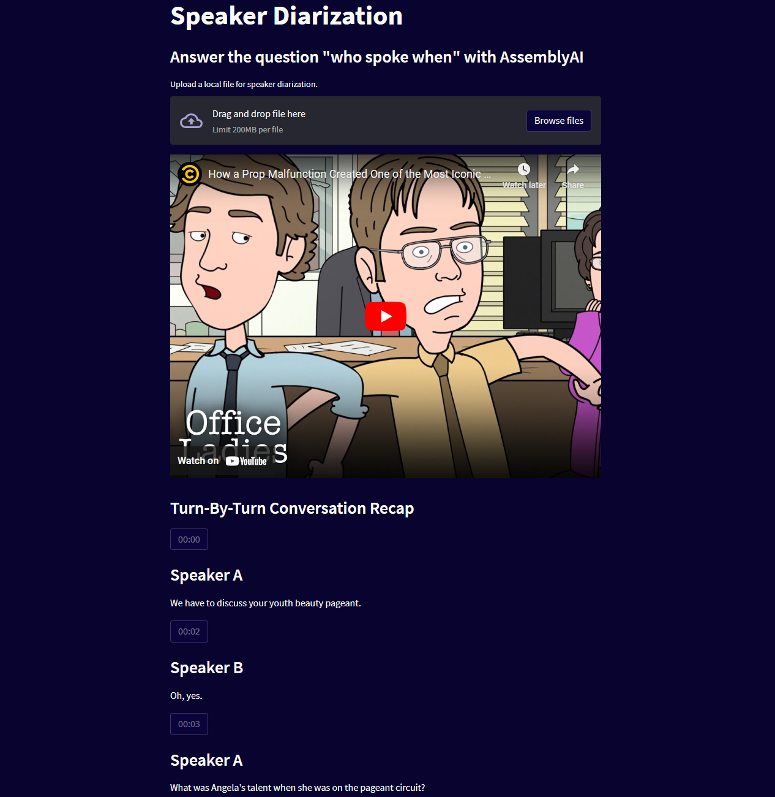

# Speaker Diarization of Audio or Video Files

## Description

This application allows you to upload a local file and use AssemblyAI's [Speaker Labels](https://www.assemblyai.com/docs/core-transcription#speaker-labels-speaker-diarization) model to display a turn-by-turn transcript of spoken audio.

## To Run

* Download project files by running `git clone https://github.com/AssemblyAI/speaker-diarization.git`
* Navigate to the project folder
* Ensure that [Streamlit](https://pypi.org/project/streamlit/) and [Pandas](https://pypi.org/project/pandas/) are installed
* Add your AssemblyAI API key to the `configure.py` file
* Run the application using the `streamlit run app.py`

## How it Works

The file you upload is [submitted to AssemblyAI API](https://www.assemblyai.com/docs/core-transcription#speaker-labels-speaker-diarization) for transcription with `speaker_labels` set to `true`. When the transcript is complete you will receive a JSON response that contains an `utterances` key. Data from the `utterance` key is iterated upon to display a turn-by-turn transcript of "who spoken when".

## Dependencies

* [Streamlit](https://pypi.org/project/streamlit/) The fastest way to build data apps in Python
* [Pandas](https://pypi.org/project/pandas/) Powerful data structures for data analysis, time series, and statistics
